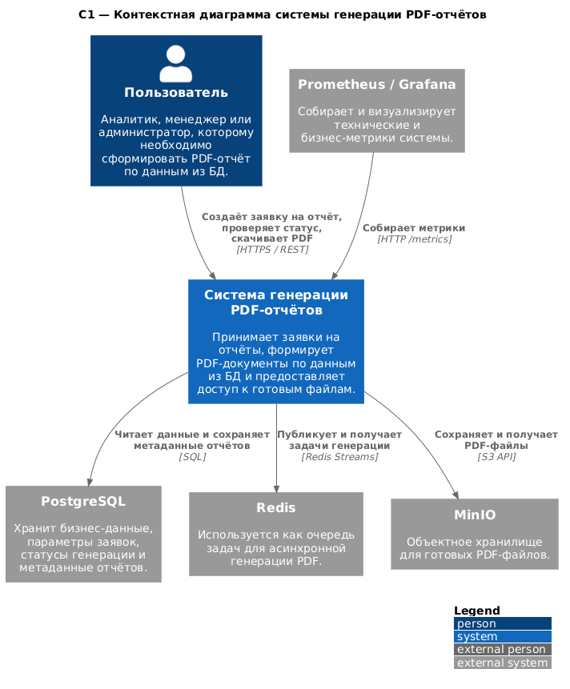
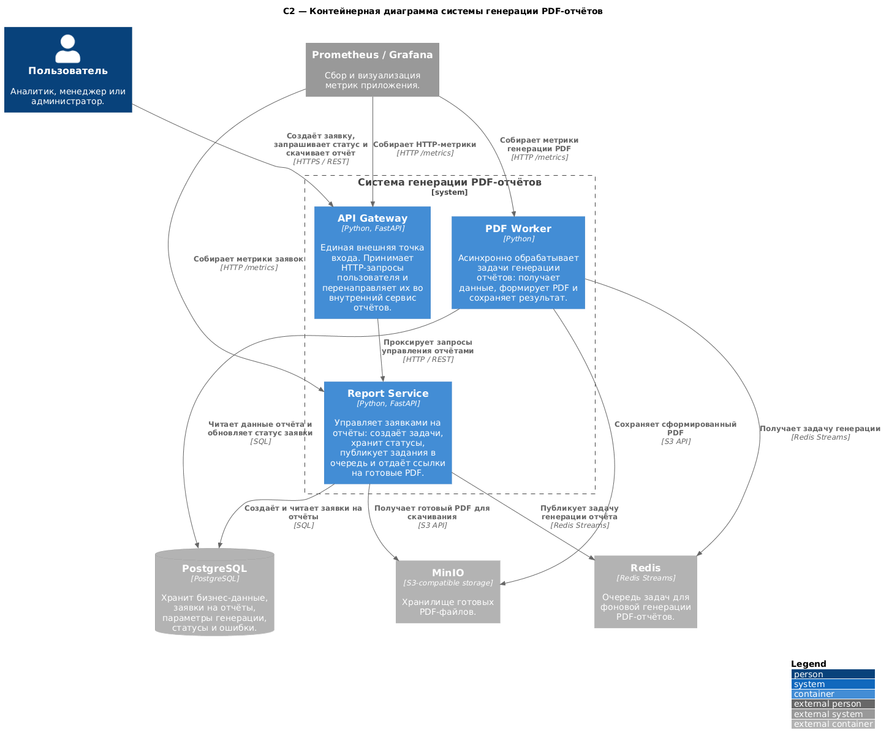
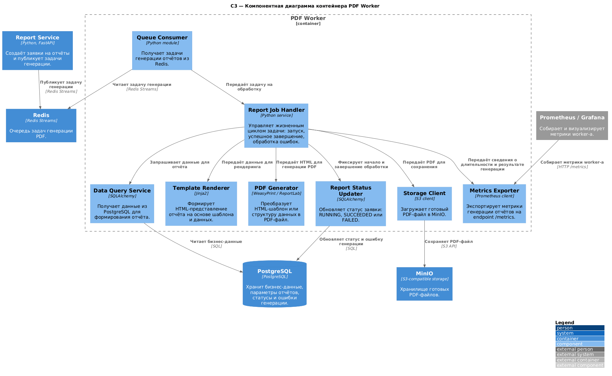

# Практика №1. Архитектурное проектирование с ИИ в нотации C4

## Тема работы

**Микросервис для генерации PDF-отчётов по данным из БД**

Проект представляет собой микросервисную систему, которая принимает заявку на формирование отчёта, асинхронно получает данные из базы данных, генерирует PDF-документ и предоставляет пользователю возможность проверить статус заявки и скачать готовый файл.

## Использованные инструменты

- **ИИ-ассистент:** ChatGPT
- **Нотация:** C4 Model
- **Язык описания диаграмм:** PlantUML, C4-PlantUML
- **Инструмент визуализации:** PlantUML Online Server
- **Формат артефактов:** `.puml`, `.png`, `README.md`

## Problem Statement

Система предназначена для аналитиков, менеджеров и администраторов, которым необходимо быстро получать PDF-отчёты на основе данных из базы данных. Пользователь отправляет параметры отчёта через REST API: тип отчёта, период, фильтры и формат. Система асинхронно формирует PDF-документ, сохраняет его в объектное хранилище и позволяет получить статус генерации или скачать готовый файл. Система взаимодействует с PostgreSQL для хранения данных и метаданных отчётов, Redis для очереди задач, MinIO для хранения PDF-файлов и Prometheus/Grafana для мониторинга.

## Общая архитектурная идея

Для системы выбрана микросервисная архитектура с асинхронной обработкой задач. Генерация PDF-отчёта может занимать значительное время, поэтому она не выполняется напрямую в пользовательском HTTP-запросе. Вместо этого пользователь создаёт заявку, получает идентификатор отчёта, а отдельный фоновый сервис обрабатывает задачу и сохраняет результат.

Основные элементы архитектуры:

- **API Gateway** — единая внешняя точка входа для пользователя;
- **Report Service** — сервис управления заявками на отчёты;
- **PDF Worker** — фоновый сервис генерации PDF-файлов;
- **PostgreSQL** — база данных для бизнес-данных и метаданных заявок;
- **Redis** — очередь задач для асинхронной генерации отчётов;
- **MinIO** — объектное хранилище готовых PDF-файлов;
- **Prometheus/Grafana** — сбор и визуализация метрик приложения.

## Структура файлов практики

```text
practice1/
├── README.md
└── diagrams/
    ├── context.puml
    ├── context.png
    ├── container.puml
    ├── container.png
    ├── component.puml
    └── component.png
```

---

## Диаграмма C1 — Контекст системы

Контекстная диаграмма показывает систему генерации PDF-отчётов как единый программный продукт и отражает её взаимодействие с пользователем и внешними системами.



[Исходный код PlantUML: `context.puml`](diagrams/context.puml)

На диаграмме представлены:

- пользователь системы;
- система генерации PDF-отчётов;
- PostgreSQL как источник данных и хранилище метаданных;
- Redis как очередь задач;
- MinIO как хранилище готовых PDF-файлов;
- Prometheus/Grafana как подсистема мониторинга.

---

## Диаграмма C2 — Контейнеры системы

Контейнерная диаграмма раскрывает внутреннюю структуру системы и показывает основные исполняемые части приложения: API Gateway, Report Service и PDF Worker.



[Исходный код PlantUML: `container.puml`](diagrams/container.puml)

На уровне контейнеров система разделена на следующие части:

| Контейнер | Назначение |
|---|---|
| API Gateway | Принимает внешние HTTP-запросы пользователя и перенаправляет их во внутренние сервисы. |
| Report Service | Создаёт заявки на отчёты, хранит параметры и статусы, публикует задачи генерации в очередь. |
| PDF Worker | Асинхронно обрабатывает задачи, получает данные, формирует PDF и сохраняет результат в MinIO. |
| PostgreSQL | Хранит бизнес-данные, заявки на отчёты, параметры генерации, статусы и ошибки. |
| Redis | Используется как очередь задач генерации PDF-отчётов. |
| MinIO | Хранит готовые PDF-файлы. |
| Prometheus/Grafana | Собирает и отображает метрики работы сервисов. |

---

## Диаграмма C3 — Компоненты контейнера PDF Worker

Для компонентной диаграммы выбран контейнер **PDF Worker**, так как именно в нём находится ключевая бизнес-логика выбранной темы: получение задачи из очереди, чтение данных, генерация PDF-файла и сохранение результата.



[Исходный код PlantUML: `component.puml`](diagrams/component.puml)

Основные компоненты PDF Worker:

| Компонент | Назначение |
|---|---|
| Queue Consumer | Получает задачи генерации отчётов из Redis. |
| Report Job Handler | Управляет жизненным циклом задачи: запуск, успешное завершение и обработка ошибок. |
| Data Query Service | Получает данные из PostgreSQL для формирования отчёта. |
| Template Renderer | Формирует HTML-представление отчёта на основе шаблона и данных. |
| PDF Generator | Преобразует HTML-шаблон или структуру данных в PDF-файл. |
| Storage Client | Загружает готовый PDF-файл в MinIO. |
| Report Status Updater | Обновляет статус заявки в базе данных. |
| Metrics Exporter | Экспортирует метрики генерации отчётов на endpoint `/metrics`. |

---

## Критический анализ результатов работы ИИ

| Аспект | Что сгенерировал ИИ | Что исправлено вручную | Обоснование исправления |
|---|---|---|---|
| Названия элементов | Часть названий была слишком общей. | Уточнены названия сервисов: API Gateway, Report Service, PDF Worker. | Так диаграмма лучше отражает структуру будущей системы. |
| Подписи связей | Некоторые связи были подписаны кратко или не очень понятно. | Уточнены подписи стрелок и добавлены протоколы взаимодействия. | Это помогает понять, как именно взаимодействуют компоненты. |
| Расположение блоков | Элементы располагались не всегда удобно для чтения. | Блоки были переставлены так, чтобы уменьшить пересечения линий. | Диаграмма стала визуально понятнее. |
| Внешние системы | Внешние сервисы были показаны без достаточного пояснения. | Добавлены описания PostgreSQL, Redis, MinIO и Prometheus/Grafana. | Это делает назначение каждой внешней системы более очевидным. |
| Компоненты worker-а | Внутренняя структура PDF Worker была описана слишком укрупнённо. | Добавлены отдельные компоненты для чтения очереди, генерации PDF, сохранения файла и обновления статуса. | Такая детализация лучше показывает основную логику генерации отчёта. |

---

## Вывод о пригодности ИИ для проектирования архитектуры

ИИ-инструменты оказались полезны на этапе подготовки чернового варианта архитектуры: с их помощью можно быстро получить основу C4-диаграмм, определить основные элементы системы и связи между ними. Однако полученный результат нельзя использовать без проверки, так как отдельные названия, подписи связей и уровень детализации требуют ручной доработки.

В ходе работы диаграммы были уточнены вручную: исправлены формулировки, добавлены более понятные подписи взаимодействий, выделены основные сервисы и внешние системы. Особенно важно было проверить, чтобы диаграммы соответствовали выбранной теме и не содержали лишних или неочевидных элементов.

Таким образом, ИИ хорошо подходит для ускорения первичного проектирования, но итоговое архитектурное решение должно приниматься человеком. Архитектор должен проверять корректность связей, границы системы и соответствие диаграмм реальной логике будущей реализации.