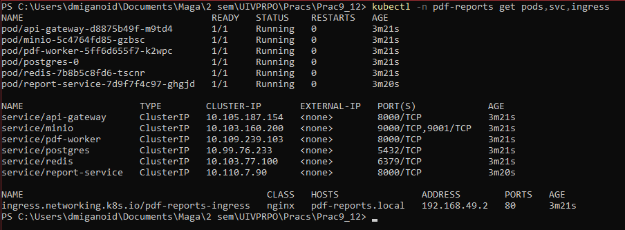
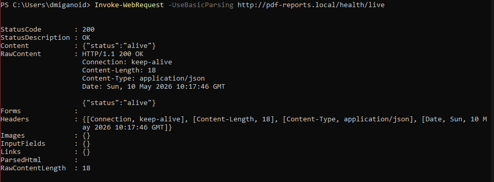
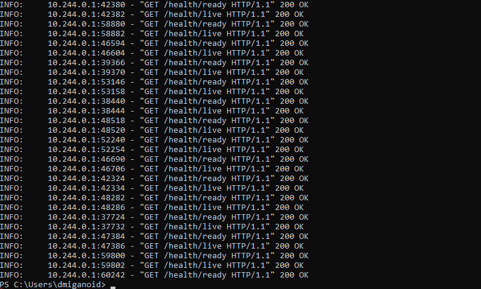

# Практика №3. Контейнеризация и деплой микросервисов в Kubernetes

## Тема

Микросервис для генерации PDF-отчётов по данным из БД.

## Цель работы

Цель работы - перенести MVP микросервисной системы из практики №2 из `docker-compose` в локальный Kubernetes-кластер Minikube без изменения бизнес-логики приложения и архитектуры сервисов.

## Состав системы

| Компонент | Docker-образ | Kubernetes-объекты | Назначение |
|---|---|---|---|
| API Gateway | `pdf-api-gateway:0.1.0` | `Deployment`, `Service`, `Ingress` | Единая внешняя точка входа, проксирует HTTP-запросы в Report Service. |
| Report Service | `pdf-report-service:0.1.0` | `Deployment`, `Service` | Создаёт заявки на отчёты, хранит статусы, публикует задачи в Redis и отдаёт готовые PDF. |
| PDF Worker | `pdf-worker:0.1.0` | `Deployment`, `Service` | Асинхронно читает задачи из Redis Streams, генерирует PDF и сохраняет файл в MinIO. |
| PostgreSQL | `postgres:16` | `StatefulSet`, `Service`, `PersistentVolumeClaim`, `ConfigMap` с `init.sql` | Хранит бизнес-данные и метаданные заявок на отчёты. |
| Redis | `redis:7` | `Deployment`, `Service` | Очередь задач генерации PDF на основе Redis Streams. |
| MinIO | `minio/minio:latest` | `Deployment`, `Service`, `PersistentVolumeClaim` | S3-совместимое хранилище готовых PDF-файлов. |

## Конфигурация

Все Kubernetes-объекты размещаются в namespace `pdf-reports`.

Несекретные параметры вынесены в `ConfigMap` `pdf-reports-config`: адреса внутренних Kubernetes Service, имена БД и Redis Stream, bucket MinIO и служебные настройки приложений. Значения сохранены совместимыми с практикой №2: база `reports_db`, пользователь `report_user`, Redis Stream `report_tasks`, bucket `reports`.

Пароли и ключи доступа вынесены в `Secret` `pdf-reports-secret`:

- `POSTGRES_USER`
- `POSTGRES_PASSWORD`
- `MINIO_ACCESS_KEY`
- `MINIO_SECRET_KEY`

Переменная `DATABASE_URL`, которую реально используют `report-service` и `pdf-worker`, собирается в `Deployment` из значений `ConfigMap` и `Secret`, чтобы пароль не хранить в ConfigMap целиком.

PostgreSQL развёрнут через `StatefulSet` с постоянным хранилищем `postgres-pvc`. Файл `practice2/db/init.sql` перенесён в `postgres-init-configmap.yaml` и подключается в контейнер по пути `/docker-entrypoint-initdb.d/init.sql`, поэтому схема и тестовые данные применяются при первом запуске пустой БД.

MinIO использует `minio-pvc` для хранения PDF-файлов. Значения `MINIO_ROOT_USER` и `MINIO_ROOT_PASSWORD` берутся из тех же Secret-ключей, что и клиентские переменные приложения, поэтому доступы MinIO и микросервисов совпадают.

Внешний доступ организован через `Ingress` с host `pdf-reports.local`. Ingress направляет только path `/` в Service `api-gateway` на порт `8000`.

В Service-манифестах `api-gateway`, `report-service` и `pdf-worker` сохранены именованные HTTP-порты `http` и добавлены labels `app: ...`. Это не меняет работу практики №3, но позволяет в практике №4 подключить сбор метрик через `ServiceMonitor`.

## Инструкция по запуску

### Bash

```bash
minikube start --driver=docker
minikube addons enable ingress

eval $(minikube docker-env)

docker build -t pdf-api-gateway:0.1.0 ./practice2/services/api-gateway
docker build -t pdf-report-service:0.1.0 ./practice2/services/report-service
docker build -t pdf-worker:0.1.0 ./practice2/services/pdf-worker

kubectl apply -f practice3/k8s/namespace.yaml
kubectl apply -f practice3/k8s/

kubectl -n pdf-reports get pods
kubectl -n pdf-reports get svc
kubectl -n pdf-reports get ingress
```

### PowerShell

```powershell
minikube start --driver=docker
minikube addons enable ingress

& minikube -p minikube docker-env --shell powershell | Invoke-Expression

docker build -t pdf-api-gateway:0.1.0 ./practice2/services/api-gateway
docker build -t pdf-report-service:0.1.0 ./practice2/services/report-service
docker build -t pdf-worker:0.1.0 ./practice2/services/pdf-worker

kubectl apply -f practice3/k8s/namespace.yaml
kubectl apply -f practice3/k8s/

kubectl -n pdf-reports get pods,svc,ingress
```

## Настройка доступа через Ingress

Для доступа к Ingress в Minikube нужно запустить туннель в отдельном терминале:

```bash
minikube tunnel
```

Затем добавить в файл hosts строку:

```text
127.0.0.1 pdf-reports.local
```

Путь к hosts в Windows:

```text
C:\Windows\System32\drivers\etc\hosts
```

Путь к hosts в Linux/macOS:

```text
/etc/hosts
```

После этого API Gateway будет доступен через:

```text
http://pdf-reports.local/
```

## Проверка работы

Проверка health endpoint:

```bash
curl http://pdf-reports.local/health/live
```

Создание отчёта:

```bash
curl -X POST http://pdf-reports.local/api/v1/reports \
  -H "Content-Type: application/json" \
  -d '{
    "report_type": "sales_summary",
    "date_from": "2026-01-01",
    "date_to": "2026-01-31",
    "filters": {}
  }'
```

Проверка статуса:

```bash
curl http://pdf-reports.local/api/v1/reports/<report_id>
```

Скачивание PDF:

```bash
curl -o report.pdf http://pdf-reports.local/api/v1/reports/<report_id>/download
```

Также можно проверить внутренние объекты:

```bash
kubectl -n pdf-reports get pods,svc,ingress
```

## Диагностика

```bash
kubectl -n pdf-reports get pods,deploy,svc,ingress
kubectl -n pdf-reports describe pod <pod-name>
kubectl -n pdf-reports logs deploy/api-gateway
kubectl -n pdf-reports logs deploy/report-service
kubectl -n pdf-reports logs deploy/pdf-worker
```

Дополнительно для проверки хранилищ:

```bash
kubectl -n pdf-reports get pvc
kubectl -n pdf-reports logs statefulset/postgres
kubectl -n pdf-reports logs deploy/minio
```

## Скриншоты

### Состояние объектов Kubernetes

Скриншот команды:



### Успешный запрос через Ingress



### Логи одного из подов

Скриншот команды:

```bash
kubectl -n pdf-reports logs deploy/pdf-worker
```

## Возможные проблемы и решения

| Проблема | Возможная причина | Решение |
|---|---|---|
| `ImagePullBackOff` | Образы приложений не собраны внутри Docker daemon Minikube или указано другое имя образа. | Выполнить `eval $(minikube docker-env)` в Bash или PowerShell-команду для docker-env, затем заново собрать `pdf-api-gateway:0.1.0`, `pdf-report-service:0.1.0`, `pdf-worker:0.1.0`. Проверить `imagePullPolicy: IfNotPresent`. |
| `CrashLoopBackOff` | Ошибка переменных окружения, недоступна зависимость или приложение падает при старте. | Посмотреть `kubectl -n pdf-reports logs deploy/<name>` и `kubectl -n pdf-reports describe pod <pod-name>`. Проверить ConfigMap, Secret и имена Service. |
| PostgreSQL не применил `init.sql` | PVC уже содержит старые данные, а `/docker-entrypoint-initdb.d/init.sql` выполняется только при первой инициализации пустой БД. | Для чистого учебного запуска удалить StatefulSet и PVC PostgreSQL: `kubectl -n pdf-reports delete statefulset postgres`, затем `kubectl -n pdf-reports delete pvc postgres-pvc`, после этого применить манифесты повторно. |
| Сервис не видит PostgreSQL/Redis/MinIO | В переменных окружения указан `localhost` или неправильное DNS-имя. | Проверить, что используются адреса Kubernetes Service: `postgres:5432`, `redis:6379`, `minio:9000`. |
| Ingress не открывается | Не включён ingress addon, не запущен `minikube tunnel`, не добавлен host `pdf-reports.local`. | Выполнить `minikube addons enable ingress`, запустить `minikube tunnel`, добавить `127.0.0.1 pdf-reports.local` в hosts. |
| Отчёт не переходит в `SUCCEEDED` | `pdf-worker` не читает Redis Stream, не может подключиться к PostgreSQL/MinIO или ошибка генерации PDF. | Проверить `kubectl -n pdf-reports logs deploy/pdf-worker`, readiness `pdf-worker`, доступность `redis`, `postgres`, `minio` и статус заявки в API. |

## Ограничения

В рамках практики №3 Prometheus и Grafana не разворачиваются, так как мониторинг вынесен в практику №4. При этом существующие endpoint `/metrics` в сервисах сохранены и доступны внутри кластера через соответствующие Service.

Локальные образы приложений должны быть собраны внутри Docker окружения Minikube. Внешний registry для учебного запуска не используется.

## Вывод

В ходе работы система была перенесена из docker-compose в Kubernetes. Для каждого микросервиса создан Deployment и Service, внешнее взаимодействие организовано через Ingress, конфигурация вынесена в ConfigMap и Secret. PostgreSQL развёрнут через StatefulSet с постоянным хранилищем, что делает хранение данных более устойчивым в рамках Kubernetes-кластера.
