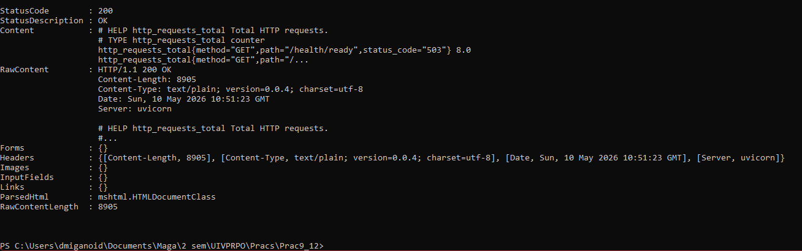
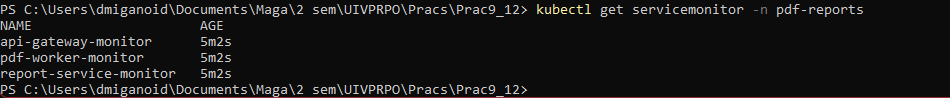
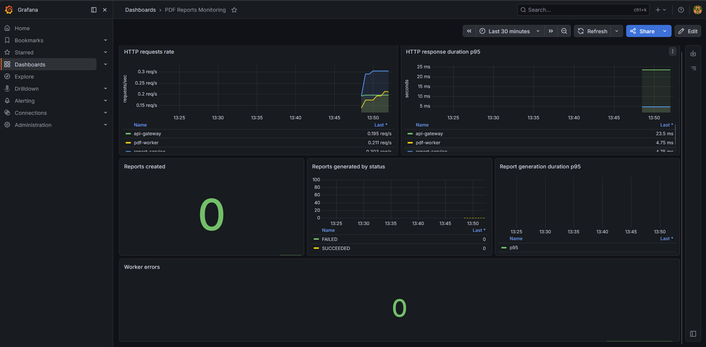
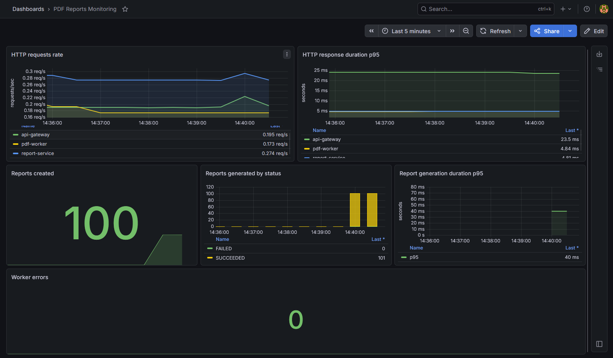
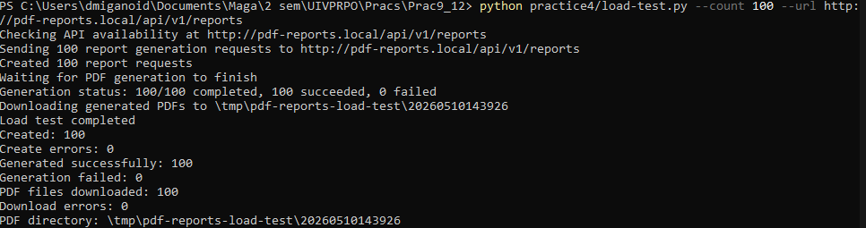

# Практика №4. Мониторинг и наблюдаемость в Kubernetes

## Тема

Микросервис для генерации PDF-отчётов по данным из БД.

## Цель работы

Развернуть систему мониторинга для микросервисного приложения в Kubernetes, настроить сбор технических и бизнес-метрик, создать дашборд и проверить изменение метрик под нагрузкой.

## Выбранная система мониторинга

Для мониторинга выбрана связка Prometheus + Grafana, устанавливаемая в Kubernetes через Helm chart `kube-prometheus-stack`.

Выбор обоснован тем, что Prometheus хорошо подходит для сбора метрик микросервисов в формате time series, Grafana позволяет строить наглядные дашборды, а `kube-prometheus-stack` удобно разворачивает Prometheus Operator, Prometheus, Grafana и связанные компоненты в Kubernetes. Для приложения используется объект `ServiceMonitor`, который декларативно описывает, с каких Kubernetes Service нужно собирать метрики.

## Метрики приложения

В сервисах практики №2 уже были реализованы endpoint `/metrics` и метрики Prometheus. Для практики №4 они используются без изменения бизнес-логики.

| Метрика | Тип | Сервис | Назначение |
|---|---|---|---|
| `http_requests_total` | Counter | `api-gateway`, `report-service`, `pdf-worker` | Количество HTTP-запросов с labels `method`, `path`, `status_code`. |
| `http_request_duration_seconds` | Histogram | `api-gateway`, `report-service`, `pdf-worker` | Длительность обработки HTTP-запросов. |
| `reports_created_total` | Counter | `report-service` | Количество созданных заявок на генерацию отчёта. |
| `reports_generated_total{status}` | Counter | `pdf-worker` | Количество завершённых генераций PDF с label `status`, например `SUCCEEDED` или `FAILED`. |
| `report_generation_duration_seconds` | Histogram | `pdf-worker` | Время генерации PDF-отчёта. |
| `report_worker_errors_total` | Counter | `pdf-worker` | Количество ошибок worker-а при обработке задач или в основном цикле. |

## Настройка сбора метрик

Приложение отдаёт метрики в формате Prometheus на endpoint `/metrics`:

- `api-gateway`: `/metrics` на HTTP-порту `8000`;
- `report-service`: `/metrics` на HTTP-порту `8000`;
- `pdf-worker`: `/metrics` на HTTP-порту `8000`.

Prometheus устанавливается через `kube-prometheus-stack`. Для подключения сервисов приложения созданы `ServiceMonitor`:

- `practice4/monitoring/api-gateway-servicemonitor.yaml`;
- `practice4/monitoring/report-service-servicemonitor.yaml`;
- `practice4/monitoring/pdf-worker-servicemonitor.yaml`.

В Kubernetes Service для `api-gateway`, `report-service` и `pdf-worker` добавлены labels `app: ...`, а HTTP-порты имеют имя `http`. Это позволяет `ServiceMonitor` выбрать нужный Service по label и собирать `/metrics` с named port `http`.

## Установка Prometheus и Grafana

Добавить Helm repository:

```bash
helm repo add prometheus-community https://prometheus-community.github.io/helm-charts
helm repo update
```

Установить или обновить `kube-prometheus-stack`:

```bash
helm upgrade --install monitoring prometheus-community/kube-prometheus-stack \
  --namespace monitoring \
  --create-namespace
```

Проверить pod-ы мониторинга:

```bash
kubectl get pods -n monitoring
```

Пробросить Grafana на локальный порт:

```bash
kubectl port-forward -n monitoring svc/monitoring-grafana 3000:80
```

После этого Grafana будет доступна по адресу:

```text
http://localhost:3000
```

Логин и пароль можно получить из Secret или использовать значения, заданные chart-ом, если они указаны при установке.

Пример получения стандартного пароля Grafana:

```bash
kubectl get secret -n monitoring monitoring-grafana \
  -o jsonpath="{.data.admin-password}" | base64 -d
```

## Установка ServiceMonitor

Применить манифесты практики №3 и объекты мониторинга:

```bash
kubectl apply -f practice3/k8s/
kubectl apply -f practice4/monitoring/
```

Проверка:

```bash
kubectl get servicemonitor -n pdf-reports
kubectl -n pdf-reports get svc
```

Ожидаемые `ServiceMonitor`:

- `api-gateway-monitor`;
- `report-service-monitor`;
- `pdf-worker-monitor`.

## Проверка endpoint /metrics

API Gateway:

```bash
kubectl -n pdf-reports port-forward svc/api-gateway 8000:8000
curl http://localhost:8000/metrics
```

Report Service:

```bash
kubectl -n pdf-reports port-forward svc/report-service 8001:8000
curl http://localhost:8001/metrics
```

PDF Worker:

```bash
kubectl -n pdf-reports port-forward svc/pdf-worker 8002:8000
curl http://localhost:8002/metrics
```

В выводе должны присутствовать технические метрики `http_requests_total`, `http_request_duration_seconds`, а также бизнес-метрики соответствующих сервисов.

## Grafana dashboard

Создан dashboard:

```text
practice4/monitoring/grafana-dashboard.json
```

Dashboard импортируется в Grafana через JSON import. При импорте нужно выбрать Prometheus datasource из установленного `kube-prometheus-stack`.

Панели dashboard:

- HTTP requests rate;
- HTTP response duration p95;
- Reports created;
- Reports generated by status;
- Report generation duration p95;
- Worker errors.

Используемые PromQL-запросы:

```promql
sum by (job) (rate(http_requests_total{path!="/metrics"}[1m]))
```

```promql
histogram_quantile(0.95, sum by (le, job) (rate(http_request_duration_seconds_bucket{path!="/metrics"}[5m])))
```

```promql
sum(increase(reports_created_total[10m]))
```

```promql
sum by (status) (increase(reports_generated_total[10m]))
```

```promql
histogram_quantile(0.95, sum by (le) (rate(report_generation_duration_seconds_bucket[5m])))
```

```promql
sum(increase(report_worker_errors_total[10m]))
```

## Нагрузочное тестирование

Для генерации нагрузки создан скрипт:

```text
practice4/load-test.py
```

Файл `practice4/load-test.sh` оставлен как Bash-обёртка для запуска Python-скрипта в Linux/Git Bash.

Скрипт выполняет полный цикл нагрузки через Ingress:

- параллельно создаёт заявки на отчёты через `POST /api/v1/reports`;
- извлекает `report_id` из ответов API;
- опрашивает `GET /api/v1/reports/{report_id}` до статуса `SUCCEEDED` или `FAILED`;
- скачивает готовые PDF через `GET /api/v1/reports/{report_id}/download`;
- печатает сводку по созданным заявкам, успешным генерациям и скачанным PDF.

Такой сценарий создаёт нагрузку не только на API Gateway и Report Service, но и на `pdf-worker`, поэтому на графиках должны меняться `reports_generated_total` и `report_generation_duration_seconds`.

Запуск через Python:

```bash
python practice4/load-test.py --count 100 --url http://pdf-reports.local/api/v1/reports
```

Запуск через Bash-обёртку:

```bash
URL=http://pdf-reports.local/api/v1/reports ./practice4/load-test.sh --count 100
```

Для PowerShell:

```powershell
python practice4/load-test.py --count 100 --url http://pdf-reports.local/api/v1/reports
```

Если Ingress `pdf-reports.local` недоступен, можно проверить через port-forward:

```powershell
kubectl -n pdf-reports port-forward svc/api-gateway 8000:8000
```

Во втором терминале:

```powershell
python practice4/load-test.py --count 10 --url http://localhost:8000/api/v1/reports
```

Дополнительные параметры:

```bash
python practice4/load-test.py \
  --url http://pdf-reports.local/api/v1/reports \
  --count 100 \
  --concurrency 20 \
  --poll-interval 2 \
  --timeout 180 \
  --download-dir /tmp/pdf-reports-load-test
```

Количество запросов можно увеличить, например:

```bash
python practice4/load-test.py --count 200 --url http://pdf-reports.local/api/v1/reports
```

## Результаты нагрузочного теста

После запуска нагрузочного теста на дашборде должны увеличиться:

- количество HTTP-запросов;
- количество созданных заявок `reports_created_total`;
- количество завершённых генераций `reports_generated_total`;
- время генерации PDF `report_generation_duration_seconds`;
- количество HTTP-запросов на скачивание PDF;
- при ошибках обработки задач - `report_worker_errors_total`.

Так как генерация выполняется асинхронно через Redis Streams, метрики `reports_created_total` растут сразу после POST-запросов, а `reports_generated_total` и `report_generation_duration_seconds` обновляются после обработки задач worker-ом. Обновлённый `load-test.py` ждёт завершения генерации и скачивает PDF, поэтому дашборд успевает показать изменения worker-метрик в рамках одного запуска.

## Скриншоты

Скриншоты нужно поместить в каталог:

```text
practice4/screenshots/
```

### Endpoint /metrics

Скриншот `curl http://localhost:8000/metrics`.



### ServiceMonitor

Скриншот `kubectl get servicemonitor -n pdf-reports`.



### Grafana dashboard до нагрузки



### Grafana dashboard после нагрузки



### Нагрузочное тестирование

Скриншот успешного выполнения `practice4/load-test.py`.



## Возможные проблемы и решения

| Проблема | Причина | Решение |
|---|---|---|
| Prometheus не видит ServiceMonitor | У `ServiceMonitor` нет label `release: monitoring`, chart установлен с другим release name или Prometheus настроен на другой selector. | Проверить release name Helm-установки, labels `ServiceMonitor` и настройки Prometheus Operator. При другом release name заменить label `release`. |
| Grafana dashboard не показывает данные | Не выбран Prometheus datasource или Prometheus ещё не собрал метрики. | При импорте dashboard выбрать datasource Prometheus, подождать несколько scrape interval и проверить targets в Prometheus. |
| `/metrics` недоступен | Сервис не запущен, неправильный port-forward или endpoint отдаётся на другом Service. | Проверить `kubectl -n pdf-reports get pods,svc`, readiness pod-а и выполнить port-forward на нужный Service. |
| Нет метрик worker-а | `pdf-worker` не запущен, Service не имеет label `app: pdf-worker` или `ServiceMonitor` смотрит не на тот named port. | Проверить `kubectl -n pdf-reports logs deploy/pdf-worker`, Service `pdf-worker` и `port: http` в `pdf-worker-servicemonitor.yaml`. |
| PromQL-запросы возвращают `no data` | Метрика ещё не появилась, запрос использует неподходящий label или выбран слишком короткий интервал. | Проверить наличие метрики в Prometheus expression browser и увеличить временной диапазон dashboard. |
| После нагрузки метрики не меняются | Запросы не доходят до Ingress, worker не успевает обработать очередь или нагрузочный тест использует неправильный URL. | Проверить `pdf-reports.local`, логи `api-gateway`, `report-service`, `pdf-worker`, а также значение `URL` при запуске `load-test.sh`. |

## Ограничения

В рамках практики №4 не добавлялись новые бизнес-функции, авторизация и frontend. Мониторинг использует уже существующие endpoint `/metrics` сервисов. `pdf-worker` отдаёт метрики через FastAPI на HTTP-порту `8000`, поэтому отдельный порт `METRICS_PORT` и `prometheus_client.start_http_server` не потребовались.

Скриншоты Grafana и Kubernetes-команд должны быть сделаны после запуска Minikube, установки `kube-prometheus-stack` и применения манифестов в локальном окружении.

## Вывод

В ходе работы была настроена система мониторинга микросервисного приложения в Kubernetes. Сервисы экспортируют метрики в формате Prometheus на endpoint `/metrics`, сбор выполняется через `ServiceMonitor`, а визуализация реализована в Grafana. Добавлены как технические метрики HTTP-запросов и времени ответа, так и бизнес-метрики генерации PDF-отчётов. Нагрузочное тестирование показало, что мониторинг позволяет наблюдать изменение активности системы и выявлять ошибки обработки задач.
